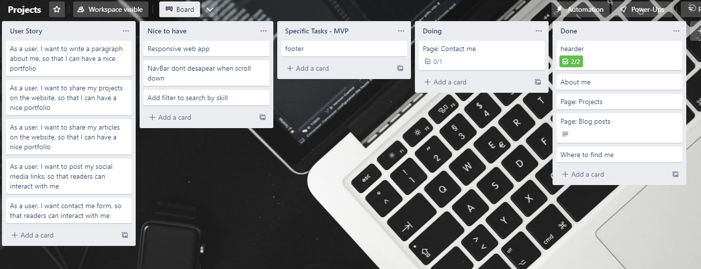

# 
Welcome to my portfolio ✨

## 
<a href="https://taybenca.github.io/">Please click here to check it!
</a>

## How did I approach designing my solution to the problem?

I wanted to build a portfolio to show the projects I have done so far, the technologies I've used, 
and a form that someone can contact me.
I wanted to build in React, and it must be responsive for mobile.

### I used Trello to keep my ideas organised
First, I opened the Trello board to write down my ideas and what is essential to have in my portfolio. 
I created cards with my own user stories, a list with MVP cards, a list of when I was doing the tasks of that card, 
a list of when they are done and a list of nice to have that I'm still implementing. 
This is important because I can always check what I have to do and where I am progressing.
 

### I used Figma to keep my creativity on track!
Figma is an exciting tool because I can use all my creativity to build something cool, and also, 
when I write my code, I have something to look at and understand better what I have to do.
 

